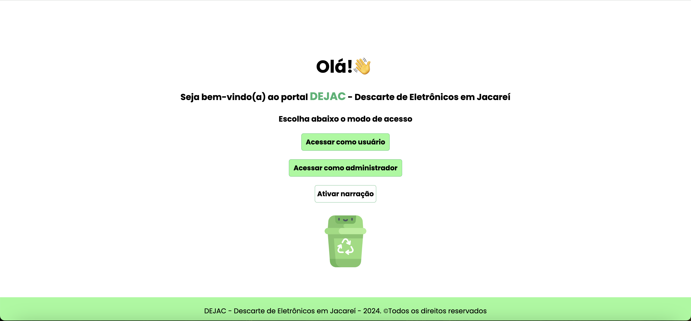

**DEJAC - Descarte de Eletrônicos em Jacareí**

**Objetivo**

A aplicação DEJAC - Descarte de Eletrônicos em Jacareí é um projeto que utiliza diversas tecnologias para apresentar dados referentes a locais de entrega voluntária de materiais eletrônicos em Jacareí.

Ao acessar a aplicação, é possível obter informações relacionadas ao endereço, telefone e email dos locais, de forma a obter mais detalhes sobre o serviço de coleta e reciclagem, bem como realizar o agendamento da entrega e saber quais produtos podem ou não ser encaminhados para os pontos de entrega.

**Tecnologias**

- Linguagem de desenvolvimento: JavaScript / TypeScript
- Linguagem de marcação e estilização: HTML, CSS
- Banco de Dados - Firebase Database (Nuvem)
- Utilização da API dos correios: `https://viacep.com.br/ws/${cep}/json/`
- Acessibilidade: narração dos textos da tela inicial, com a utilização do recurso speakText
- Controle de versão: Git/Github

**Ferramenta de desenvolvimento**

Visual Studio Code (VS Code)

**Como executar o projeto**

- Criar uma pasta para o projeto
- Abrir o VSCODE, clicar em "Abrir Pasta" e localizar a pasta criada. Abrir um terminal e executar o comando: `git clone git@github.com:isaias30silva/Univesp_DejacB.git`
- Executar o comando `npm install`
- Executar o comando `npm install firebase`
- Executar o comando `npm install firebase-admin`
- Para rodar o projeto, executar o comando `npm run start`
- Se tudo estiver funcionando corretamente, o back-end estará rodando na URL: [http://localhost:3000/](http://localhost:3000/) e apresentará a tela inicial da imagem acima.

Com o funcionamento do frontend, o próximo passo será baixar o projeto backend, disponível em:  
`git@github.com:isaias30silva/Univesp_DejacB.git`

**Utilizando o sistema**

Na tela inicial, haverão duas opções de acesso: "Acessar como Usuário" e "Acessar como Administrador".
Também haverá um recurso de acessibilidade na tela inicial: um leitor de tela, que estará disponível no botão "Ativar Narração". Para encerrar o recurso de narração, basta clicar no botão "Desativar Narração".

**Acessar como Usuário**

No acesso modo usuário, será possível visualizar informações sobre o descarte de eletrônicos, bem como uma tabela com os endereços cadastrados na aplicação.

**Acessar como Administrador**

No acesso modo administrador, será necessário logar como administrador, inserido "admin" nos campos usuário e senha.

- Na tela de cadastro, haverão campos a serem preenchidos. O campo "CEP" preencherá os campos Endereço, N.º, Bairro, Cidade e Estado automaticamente, caso o CEP seja válido (não inserir traço, apenas números).

- Caso o usuário inserida algo diferente de dígitos nos campos "Telefone" e "N.º", será exibido um alerta.

- Ao clicar em "Salvar" o registro será exibido na tabela do campo "PONTOS DE ENTREGA VOLUNTÁRIA CADASTRADOS".

- Para remover um cadastro, basta clicar no ícone de lixeira localizado à direita da tabela, e para editar um cadastro, basta clicar no ícone de lápis da tabela.

- No mode de edição, os dados serão inseridos nos respectivos campos da cadastro da tabela referente ao campo "CADASTRO PONTO DE ENTREGA VOLUNTÁRIA". Após a edição, basta clicar no botão "SALVAR" para que as alterações sejam armazenadas no banco de dados.

**Equipe de desenvolvimento**

<table>
  <tr>
    <td align="center">
      
      
Bruno Gabriel

    </td>
    <td align="center">
      
      
Bruno Malvão

    </td>
    <td align="center">
      
      
Denise

    </td>
    <td align="center">
      
      
<a href="https://www.linkedin.com/in/isaias-menezes-silva/">Isaias</a>

    </td>
    <td align="center">
      
      
Rodrigo

    </td>
    <td align="center">
      
      
Rodolfo

    </td>
  </tr>
</table>
